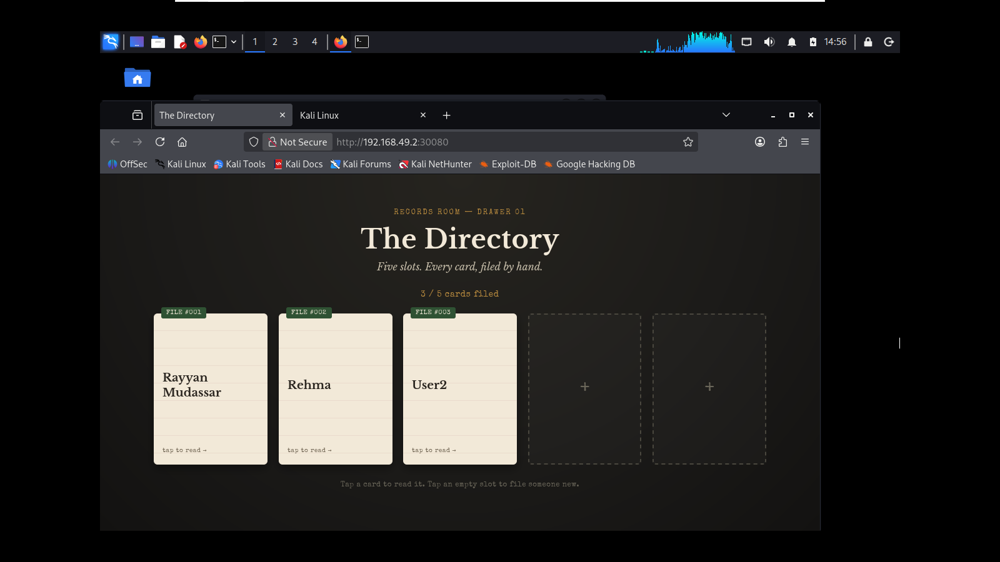
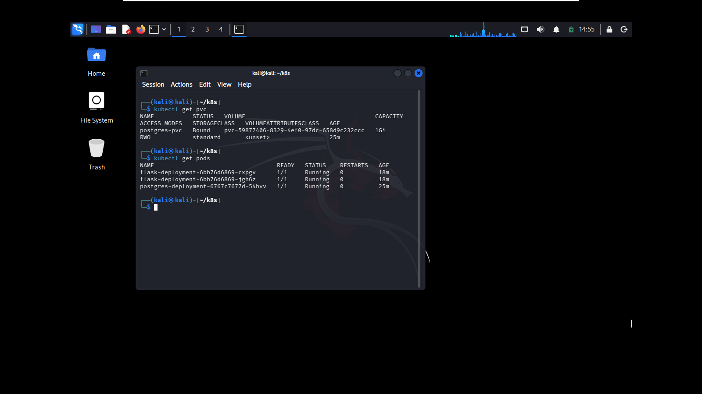
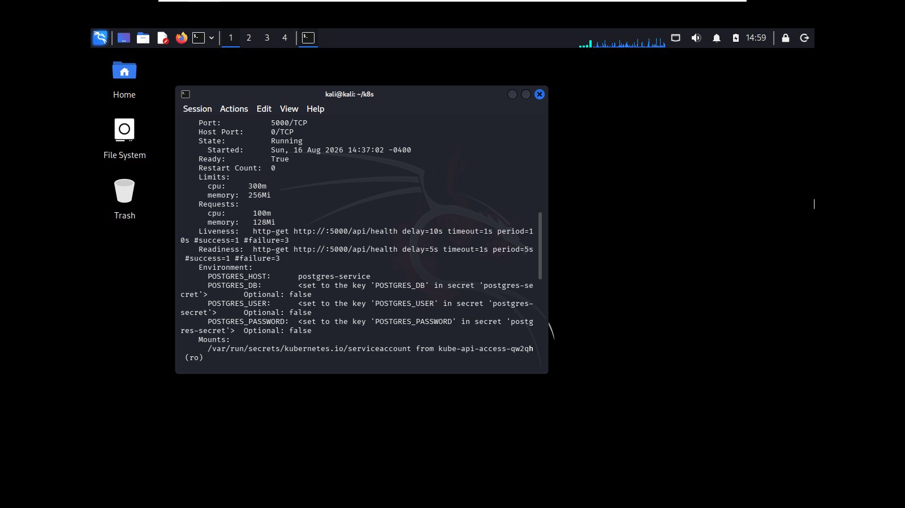

# The Directory — Flask + Postgres on Kubernetes

A small people-directory app (add up to 5 people, click a card to flip and see their details) built to practice deploying a real multi-service application on Kubernetes.



## Stack

- **Frontend:** HTML/CSS/JS served directly by Flask (single deployment, single Service — no separate frontend service)
- **Backend:** Python Flask, REST API (`/api/people`)
- **Database:** PostgreSQL 15
- **Orchestration:** Kubernetes (local via minikube)
- **Containerization:** Docker, non-root hardened image

## Architecture

```
Browser
   │
   ▼
flask-service (NodePort :30080)
   │
   ▼
flask-deployment (2 replicas)
   │  reads/writes via env vars from postgres-secret
   ▼
postgres-service (ClusterIP :5432)
   │
   ▼
postgres-deployment (1 replica)
   │
   ▼
postgres-pvc (1Gi, persistent across pod restarts)
```

Six manifests: `postgres-secret.yaml`, `postgres-pvc.yaml`, `postgres-deployment.yaml`, `postgres-service.yaml`, `flask-deployment.yaml`, `flask-service.yaml`.

## What this project demonstrates

- Writing Deployment, Service, Secret, and PersistentVolumeClaim manifests by hand
- Kubernetes' declarative reconciliation model (`kubectl apply` vs manual `kubectl edit`)
- Service-to-service networking via Kubernetes' internal DNS
- Persistent storage — decoupling data lifetime from pod lifetime with a PVC
- Liveness and readiness probes for self-healing and traffic-gating
- Debugging a real cluster networking/auth failure end to end



## Persistent storage

Postgres data survives pod deletion/recreation via a `PersistentVolumeClaim` mounted at `/var/lib/postgresql/data`. Verified by filing people into the directory, deleting the Postgres pod directly, and confirming the data was still there after the replacement pod came up.

## Health checks

Both containers use readiness and liveness probes.

- **Readiness** — controls whether the Service routes traffic to a pod. Flask needs this because on startup it retries its DB connection; until that succeeds, the pod shouldn't receive user traffic.
- **Liveness** — controls whether Kubernetes restarts a container that's stuck, even if the process hasn't crashed outright.
- Flask is checked via a dedicated `/api/health` HTTP endpoint; Postgres is checked via `pg_isready`, since it speaks the Postgres wire protocol, not HTTP.



## Debugging story: the DB password / env var mismatch

While redeploying, the app came back with pods running fine but the page throwing a 500. I checked kubectl logs and found a Postgres auth failure — confusing at first, since the network path to Postgres was clearly working. Digging in, I found the deployment YAML was injecting env vars named DB_HOST/DB_USER/DB_PASSWORD/DB_NAME, while the app code was reading POSTGRES_HOST/POSTGRES_USER/POSTGRES_PASSWORD/POSTGRES_DB. Since the code used .get() with a default fallback, the mismatch didn't crash — it silently connected with the wrong credentials instead. Fixed it by aligning the var names to the actual secret keys. It taught me that silent fallbacks in config code can hide real bugs — I'd rather config fail loudly than quietly run wrong.
## Running it locally

```bash
kubectl apply -f postgres-secret.yaml
kubectl apply -f postgres-pvc.yaml
kubectl apply -f postgres-deployment.yaml
kubectl apply -f postgres-service.yaml
kubectl apply -f flask-deployment.yaml
kubectl apply -f flask-service.yaml

minikube service flask-service --url
```

## Next steps

- EKS deployment (moving from minikube to real AWS-managed Kubernetes)
- Prometheus/Grafana for monitoring
- Trivy image scanning in CI/CD
- ArgoCD for GitOps-based deployment
