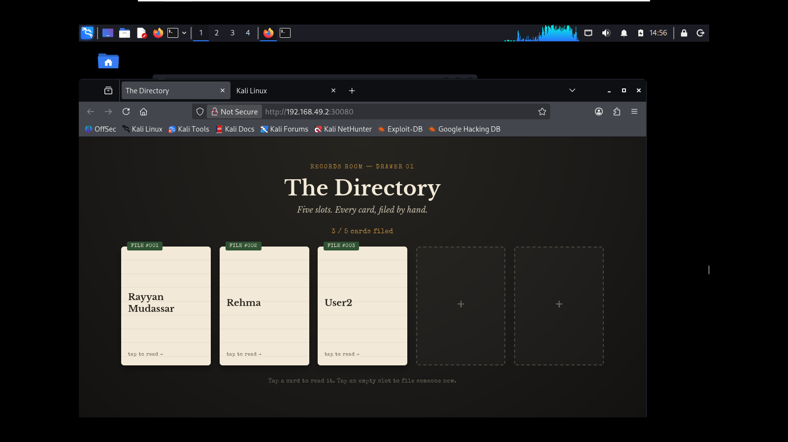
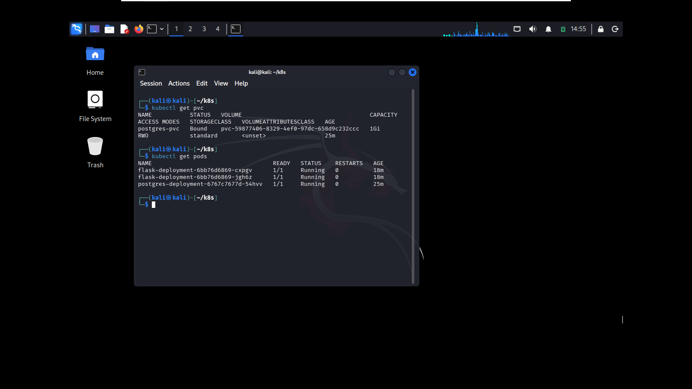
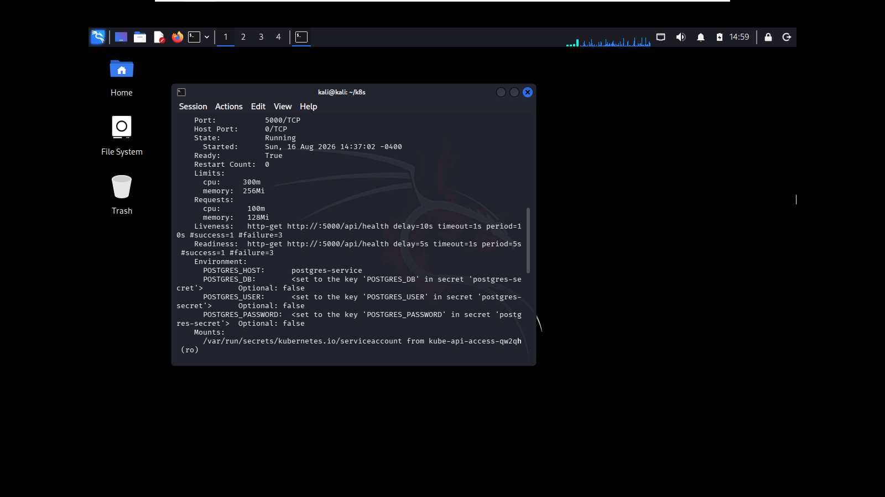

# The Directory — Flask + Postgres on Kubernetes

A small people-directory app (add up to 5 people, click a card to flip and see their details) built to practice deploying a real multi-service application on Kubernetes.



## Stack

- **Frontend:** HTML/CSS/JS served directly by Flask (single deployment, single Service — no separate frontend service)
- **Backend:** Python Flask, REST API (`/api/people`)
- **Database:** PostgreSQL 15
- **Orchestration:** Kubernetes (local via minikube)
- **Containerization:** Docker, non-root hardened image

## Architecture

```
Browser
   │
   ▼
flask-service (NodePort :30080)
   │
   ▼
flask-deployment (2 replicas)
   │  reads/writes via env vars from postgres-secret
   ▼
postgres-service (ClusterIP :5432)
   │
   ▼
postgres-deployment (1 replica)
   │
   ▼
postgres-pvc (1Gi, persistent across pod restarts)
```

Six manifests: `postgres-secret.yaml`, `postgres-pvc.yaml`, `postgres-deployment.yaml`, `postgres-service.yaml`, `flask-deployment.yaml`, `flask-service.yaml`.

## What this project demonstrates

- Writing Deployment, Service, Secret, and PersistentVolumeClaim manifests by hand
- Kubernetes' declarative reconciliation model (`kubectl apply` vs manual `kubectl edit`)
- Service-to-service networking via Kubernetes' internal DNS
- Persistent storage — decoupling data lifetime from pod lifetime with a PVC
- Liveness and readiness probes for self-healing and traffic-gating
- Debugging a real cluster networking/auth failure end to end



## Persistent storage

Postgres data survives pod deletion/recreation via a `PersistentVolumeClaim` mounted at `/var/lib/postgresql/data`. Verified by filing people into the directory, deleting the Postgres pod directly, and confirming the data was still there after the replacement pod came up.

## Health checks

Both containers use readiness and liveness probes.

- **Readiness** — controls whether the Service routes traffic to a pod. Flask needs this because on startup it retries its DB connection; until that succeeds, the pod shouldn't receive user traffic.
- **Liveness** — controls whether Kubernetes restarts a container that's stuck, even if the process hasn't crashed outright.
- Flask is checked via a dedicated `/api/health` HTTP endpoint; Postgres is checked via `pg_isready`, since it speaks the Postgres wire protocol, not HTTP.



## Debugging story: the DB password / env var mismatch

While redeploying, the app came back with pods running fine but the page throwing a 500. I checked kubectl logs and found a Postgres auth failure — confusing at first, since the network path to Postgres was clearly working. Digging in, I found the deployment YAML was injecting env vars named DB_HOST/DB_USER/DB_PASSWORD/DB_NAME, while the app code was reading POSTGRES_HOST/POSTGRES_USER/POSTGRES_PASSWORD/POSTGRES_DB. Since the code used .get() with a default fallback, the mismatch didn't crash — it silently connected with the wrong credentials instead. Fixed it by aligning the var names to the actual secret keys. It taught me that silent fallbacks in config code can hide real bugs — I'd rather config fail loudly than quietly run wrong.

## Monitoring — RED & USE dashboards (Latest Improvement)

Instrumented the Flask API with `prometheus-flask-exporter` and built a
Grafana dashboard using the RED method (Rate, Errors, Duration) for the
app and the USE method (Utilization, Saturation, Errors) for pod/node
resources. Dashboard JSON is in `monitoring/`.


**What I validated with it:**
- Deleted the Postgres pod mid-traffic and watched Kubernetes reschedule
  it automatically — confirmed via the pod-restart panel and PVC data
  persistence (no data loss after restart).
  
## CI/CD pipeline
Added a GitHub Actions workflow (`.github/workflows/ci-cd.yaml`) to automate build, test, and deploy, so a push to the repo takes the app from code to a running cluster state without manual `kubectl apply` steps.
 
### Debugging story: duplicate manifests silently breaking the pipeline
The pipeline started failing in a way that made no sense — the YAML being applied looked correct, but deploys kept coming out wrong or half-applied. After digging through the run logs, I found the repo actually had **two folders holding the same set of manifests** (leftovers from an earlier restructuring of the project), and the pipeline was picking up files from both — applying whichever version it read last, depending on folder order. Nothing about the pipeline config itself was wrong; the repo's file layout was lying to it. Fixed it by cleaning up the file system so there's a single source of truth for the manifests, then pointing the pipeline explicitly at that one path. Lesson: a CI/CD pipeline is only as trustworthy as the repo structure feeding it — "it works on my machine" bugs can just as easily be "it works because of which folder got globbed first" bugs.
 
## Helm chart (EKS-ready)
Converted the raw manifests into a Helm chart so the app installs and upgrades as a single `helm install` / `helm upgrade` release — the packaging needed before this moves to real AWS-managed Kubernetes (EKS).
 
### Debugging story: the PVC that wouldn't forget the old password
After updating the Postgres credentials in the Helm chart's values and re-deploying, Postgres kept authenticating with the **old** password — even though the Secret clearly had the new one. The Postgres pod restarted fine, so at first this looked like the same env-var-mismatch class of bug as before. It wasn't: the PVC already had a Postgres data directory initialized with the old credentials on disk, so every restart just remounted that same old state — Postgres never re-read the new Secret because it doesn't re-initialize an existing data directory. The Helm upgrade had updated the Secret; it had no power over what was already written to the volume. Fixed it by deleting the PV and PVC so Postgres would initialize fresh, and switched to a temporary password generated/injected at runtime for new installs, so future re-deploys don't get stuck fighting stale disk state. Lesson: with PVCs (and StatefulSets in general), `helm upgrade` or `kubectl apply` can't undo what's already persisted — the data directory on disk wins over whatever the Secret currently says.
 
## Next steps
- EKS deployment (moving from minikube to real AWS-managed Kubernetes)
- Trivy image scanning in CI/CD
- ArgoCD for GitOps-based deployment
